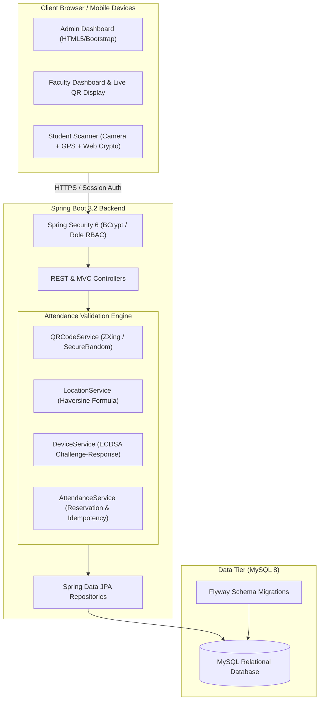
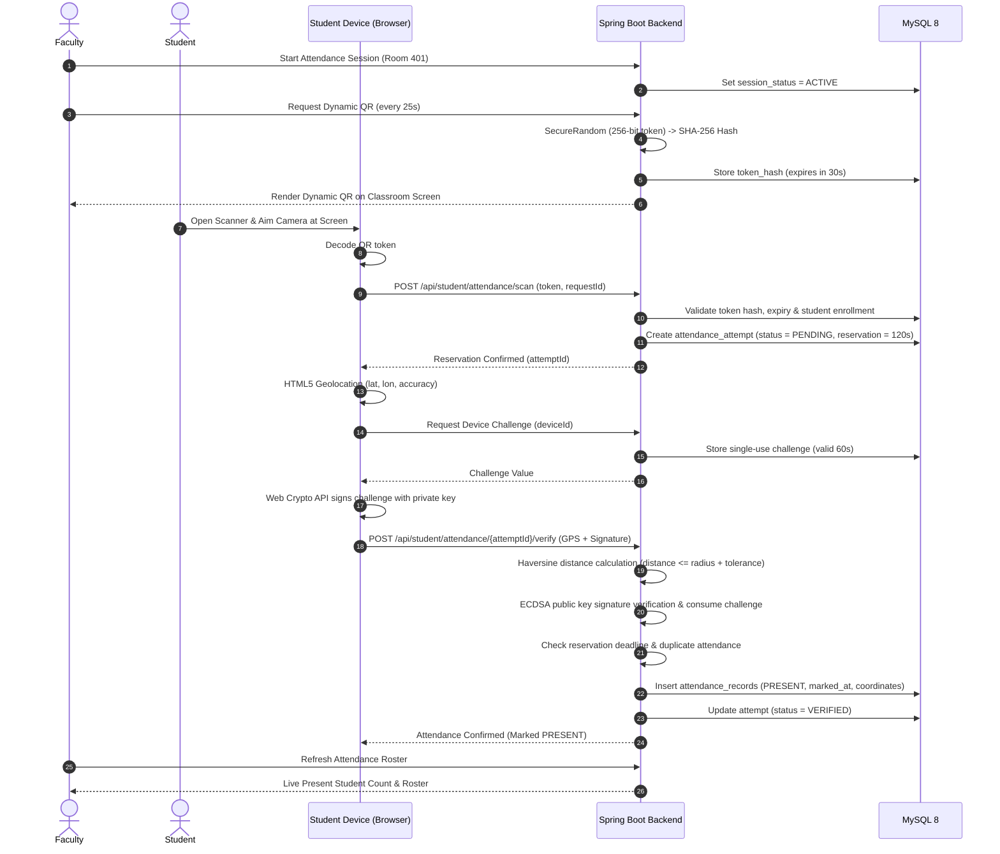

# System Architecture & Verification Workflow

## 1. High-Level Architecture

```mermaid
graph TD
    subgraph Client["Client Browser / Mobile Devices"]
        AdminUI["Admin Dashboard (HTML5/Bootstrap)"]
        FacultyUI["Faculty Dashboard & Live QR Display"]
        StudentUI["Student Scanner (Camera + GPS + Web Crypto)"]
    end

    subgraph SpringBoot["Spring Boot 3.2 Backend"]
        Security["Spring Security 6 (BCrypt / Role RBAC)"]
        Controllers["REST & MVC Controllers"]
        
        subgraph Engine["Attendance Validation Engine"]
            QRService["QRCodeService (ZXing / SecureRandom)"]
            LocationService["LocationService (Haversine Formula)"]
            DeviceService["DeviceService (ECDSA Challenge-Response)"]
            AttendService["AttendanceService (Reservation & Idempotency)"]
        end
        
        Repositories["Spring Data JPA Repositories"]
    end

    subgraph Storage["Data Tier (MySQL 8)"]
        MySQL[(MySQL Relational Database)]
        Flyway["Flyway Schema Migrations"]
    end

    Client -->|HTTPS / Session Auth| Security
    Security --> Controllers
    Controllers --> Engine
    Engine --> Repositories
    Repositories --> MySQL
    Flyway --> MySQL
```

---

## 2. Multi-Stage Verification Sequence Diagram

```mermaid
sequenceDiagram
    autonumber
    actor Faculty
    actor Student
    participant Browser as Student Device (Browser)
    participant Server as Spring Boot Backend
    participant DB as MySQL 8

    Faculty->>Server: Start Attendance Session (Room 401)
    Server->>DB: Set session_status = ACTIVE
    Faculty->>Server: Request Dynamic QR (every 25s)
    Server->>Server: SecureRandom (256-bit token) -> SHA-256 Hash
    Server->>DB: Store token_hash (expires in 30s)
    Server-->>Faculty: Render Dynamic QR on Classroom Screen

    Student->>Browser: Open Scanner & Aim Camera at Screen
    Browser->>Browser: Decode QR token
    Browser->>Server: POST /api/student/attendance/scan (token, requestId)
    Server->>DB: Validate token hash, expiry & student enrollment
    Server->>DB: Create attendance_attempt (status = PENDING, reservation = 120s)
    Server-->>Browser: Reservation Confirmed (attemptId)

    Browser->>Browser: HTML5 Geolocation (lat, lon, accuracy)
    Browser->>Server: Request Device Challenge (deviceId)
    Server->>DB: Store single-use challenge (valid 60s)
    Server-->>Browser: Challenge Value
    Browser->>Browser: Web Crypto API signs challenge with private key
    Browser->>Server: POST /api/student/attendance/{attemptId}/verify (GPS + Signature)

    Server->>Server: Haversine distance calculation (distance <= radius + tolerance)
    Server->>Server: ECDSA public key signature verification & consume challenge
    Server->>Server: Check reservation deadline & duplicate attendance
    Server->>DB: Insert attendance_records (PRESENT, marked_at, coordinates)
    Server->>DB: Update attempt (status = VERIFIED)
    Server-->>Browser: Attendance Confirmed (Marked PRESENT)
    Faculty->>Server: Refresh Attendance Roster
    Server-->>Faculty: Live Present Student Count & Roster
```

